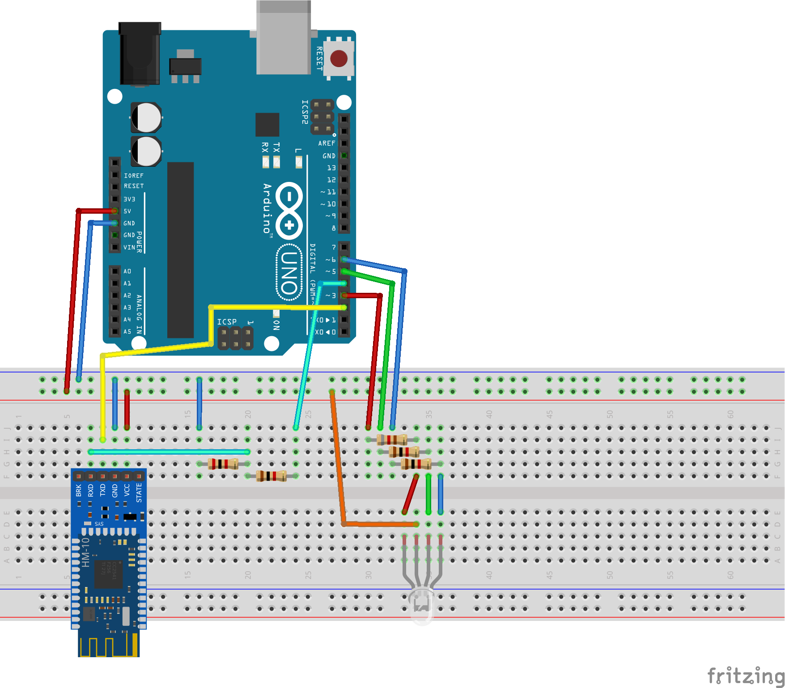

# Hardware description

Originally, the RGB controller was implemented using AVR Xmega microcontroller. To keep things simple, it was ported to Arduino, because it's easier to understand for everyone.

## Circuit

- Arduino Uno R3 board was used as a controller.
- RGB is a common-anode 10mm LED, connected directly to Arduino PWM pins. Here, 1k resistors are used to limit the LED current.
- Bluetooth is a cheap `HM-10 / MLT-BT05` BT 4.0 module. Communicates over 3.3V, but needs 5V supply. (when powered with 3.3V, it enters the AT mode). [A comprehensive guide to this module can be found here](http://www.martyncurrey.com/hm-10-bluetooth-4ble-modules/). The module has one custom BLE service (`0xFFE0`) with one characteristics (`0xFFE1`) for serial communication.
- A resistor voltage divider is used on the `Arduino TX -> Bluetooth RX` line to lower the input voltage from 5V to around 3.3V. Resistor ratio is 2k/1k.

The circuit:

## Arduino software

To simplify the implementatnion as much as possible, some additional Arduino libraries were used:

- [TimerOne](https://github.com/PaulStoffregen/TimerOne) - uses Timer 1 to generate regular interrupts
- [SerialCommands](https://github.com/ppedro74/Arduino-SerialCommands) - to help parse commands received by bluetooth serial.

The code is pretty straightforward. The Bluetooth module is talking via `SoftwareSerial` on pins `2` and `4`. Pins `3`, `5` and `6` are PWM pins for RGB. After the startup sequence, the program waits for command in format `RGB xxx yyy zzz\r\n` where `xxx`, `yyy` and `zzz` are integers in range 0-255.

A simple linear fading functionality was implemented. It takes about 256ms for a value to go from 0 to 255. It is enough, when audio commands are sent with about 100ms interval.
